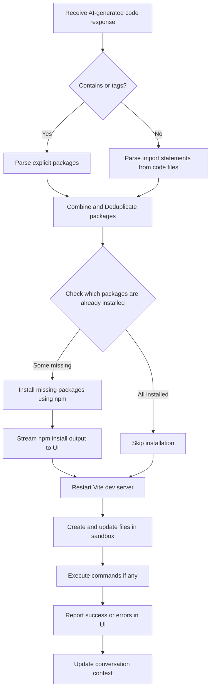

# Automated Package Detection and Installation

This guide walks you through how Open Lovable’s AI-driven system automatically detects required npm packages during code generation or editing, and how it installs them inside the sandbox environment seamlessly. You’ll learn how package detection works via XML tags in AI-generated responses, the automation of package installation, and how to manage custom dependencies effectively.

---

## 1. Workflow Overview

### What This Guide Achieves

You will learn how to leverage the AI system to:
- Automatically identify npm packages needed for your generated or edited code
- Automate installing these packages inside your sandbox without manual intervention
- Understand how packages are detected both explicitly and implicitly
- Manage custom package dependencies and post-install commands

### Prerequisites

Before proceeding, ensure you have:
- An active sandbox environment created in Open Lovable
- AI-generated code responses that include XML tags or import statements referencing external packages
- Access to the AI chat interface or API endpoints capable of applying AI-generated code

### Expected Outcome

By following this guide, you will be able to:
- See npm packages automatically detected from your AI-generated code
- Witness real-time package installation progress messages in the UI
- Understand how and when the system installs packages, creating a smooth developer experience
- Handle custom dependencies using XML `<package>` tags

### Time Estimate

Allow 5-15 minutes to familiarize yourself with the process and try it out.

### Difficulty Level

Intermediate technical users with basic understanding of npm package management.

---

## 2. How Automated Package Detection Works

### Parsing AI-Generated Responses

Open Lovable’s backend parses AI-generated code responses to extract:
- **Files** within `<file path="...">` XML tags
- **Packages** within `<package>` and `<packages>` tags
- **Commands** within `<command>` tags for execution inside the sandbox

The parsing logic carefully manages duplicates, prefers complete file versions, and extracts npm package names accurately.

### Explicit Package Tags

You can specify packages directly in the AI output using:

```xml
<package>react-router-dom</package>
<packages>
react-router-dom
axios
@heroicons/react
</packages>
```

This enables the system to know precisely which packages to install before creating or updating files.

### Implicit Package Detection

If no explicit packages are provided, the system detects packages automatically by scanning import statements from generated source code files:
- Parses ES6 `import` and CommonJS `require` statements
- Filters out relative imports and Node.js built-in modules
- Extracts package names, including scoped packages like `@heroicons/react`
- Deduplicates and compiles a list of needed packages

### Package Installation Process

Once packages are identified, the system:
1. Checks which packages are already installed based on `package.json` and filesystem nodes
2. Installs missing packages using `npm install` with appropriate flags
3. Handles conflicting dependencies using `--legacy-peer-deps` flag by default
4. Provides real-time streaming feedback of `npm install` output to the UI
5. Restarts the Vite dev server post-install to reload newly added packages

### Command Execution

Any commands specified by `<command>` tags are executed after file creation and package installation, with real-time stdout/stderr streaming.

---

## 3. Step-by-Step Instructions

### Installing Packages Automatically During AI Code Application

<Steps>
<Step title="Submit AI code with XML package tags or imports">
Use the AI chat interface or API to generate code containing either explicit `<package>` or `<packages>` XML tags, or code with import statements referencing external packages.
</Step>

<Step title="Parse AI response and extract packages">
The backend parses the AI response to extract files, packages, and commands. It detects explicit package tags and also scans all parsed file contents for additional package imports.
</Step>

<Step title="Determine packages to install">
The system checks which packages from the combined list are already installed in the sandbox by examining the `package.json` dependencies and node_modules.
</Step>

<Step title="Start package installation">
Only the missing packages are installed using `npm install --legacy-peer-deps <packages>`. The system streams real-time npm output back to the UI, showing command progress, warnings, and errors.
</Step>

<Step title="Restart development server">
After successful installation, the Vite dev server is restarted automatically to acknowledge the new dependencies.
</Step>

<Step title="Create or update files">
Once packages are installed, the system writes the generated files into the sandbox, skipping config files that exist already.
</Step>

<Step title="Execute post-install commands">
Any commands specified in `<command>` tags are executed sequentially, streaming their output back.
</Step>

<Step title="Verify success and update UI">
The system reports success or failure with detailed messages, updating the UI and conversation context.
</Step>
</Steps>

---

## 4. Examples & XML Tag Usage

### Example AI Response with Packages and Commands

```xml
<explanation>
Creating a React app with routing and API integration.
</explanation>

<packages>
react-router-dom
axios
@heroicons/react
</packages>

<file path="src/App.jsx">
import React from 'react';
import { BrowserRouter as Router } from 'react-router-dom';
import { HomeIcon } from '@heroicons/react/24/solid';
// ... rest of code ...
</file>

<command>npm run build</command>
```

### Applying AI Generated Code with Embedded Packages

When you apply code like the above, the system:
- Detects `react-router-dom`, `axios`, and `@heroicons/react` from the `<packages>` tag
- Runs `npm install` for only missing packages inside your sandbox
- Shows real-time npm logs in the UI for transparency
- Creates files only after packages are installed
- Runs the specified command `npm run build` afterwards

---

## 5. Best Practices & Tips

- **Always specify packages explicitly** if critical to your features using `<package>` or `<packages>` tags.
- **Group multiple packages** under a single `<packages>` tag to optimize the installation batch.
- **Avoid redundant installations** by relying on the system’s built-in check against existing packages.
- **Use `<command>` tags responsibly** for essential tasks like building or testing after package installation.
- **Prefer Tailwind CSS classes over custom CSS imports**; the system strips unwanted CSS imports from JSX/TSX files automatically.
- **Review streaming logs** in the UI for warnings or errors that may need your attention.

---

## 6. Troubleshooting

### Common Issues

<AccordionGroup title="Package Installation Issues">
<Accordion title="NPM Resolution Errors (ERESOLVE)">
Sometimes npm may report dependency conflicts with an `ERESOLVE` error. The system uses `--legacy-peer-deps` flag to mitigate common conflicts. If errors persist, consider revising your dependency versions.
</Accordion>
<Accordion title="Packages Not Found After Installation">
The system verifies package installation by checking `package.json` and `node_modules`. Some packages with non-standard distributions may not be detected properly. Verify manually if necessary.
</Accordion>
<Accordion title="Real-Time Output Missing in UI">
Ensure your browser supports Server-Sent Events and that your network connection is stable. The UI shows streamed output from the backend for package installation.
</Accordion>
</AccordionGroup>

### File Creation Errors

- Skip config files like `package.json` and `tailwind.config.js` that already exist to prevent overwriting.
- If file creation fails, check permissions or sandbox state.

### Command Execution Failures

- Commands run after file creation may fail if dependencies or files are missing.
- Review the streamed stderr output in the UI for error details.

---

## 7. Next Steps & Related Documentation

- Explore [Creating and Managing a New AI Sandbox](./initialize-ai-sandbox) to understand sandbox creation.
- Learn how to [Generate React App Code with AI](./ai-code-generation) for efficient coding.
- Use the [Applying AI-Suggested Code to Your Sandbox](./apply-ai-changes) guide to deepen your workflow.
- Refer to the [Package Detection and Installation Guide](./PACKAGE_DETECTION_GUIDE.md) for detailed API and XML usage.
- For UI experience, see the [UI Feedback Demonstration](./UI_FEEDBACK_DEMO.md).

---

## Summary Diagram: Package Detection and Installation Flow



---