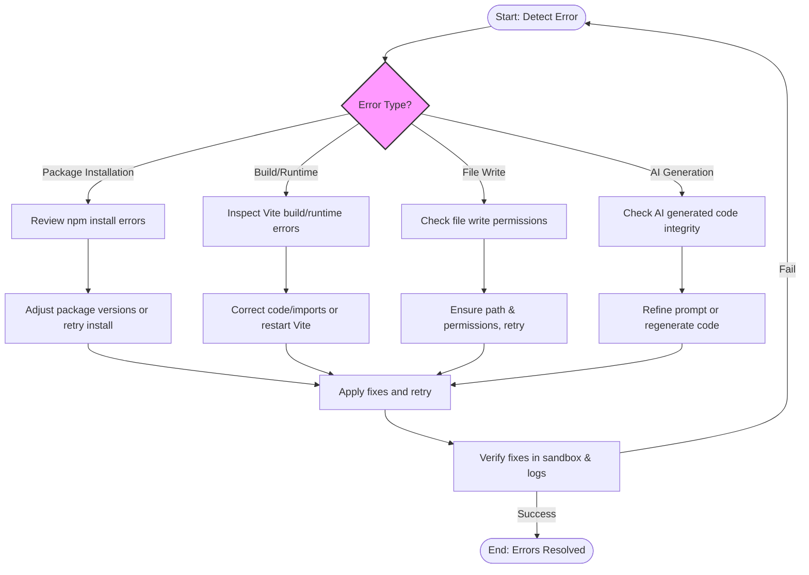

# Dealing with Errors and Leveraging Live Feedback

Errors can arise during AI code generation, package installation, or sandbox execution phases of Open Lovable. This guide empowers you to interpret, debug, and resolve these errors effectively using the product's live feedback mechanisms, ensuring a smooth, productive development workflow.

---

## 1. Understanding the Error Feedback Loop

Open Lovable integrates real-time error reporting and feedback directly into the UI and backend processes, allowing you to identify issues early and act promptly.

### Key Aspects:
- **Real-Time Streaming Feedback:** As code and commands are processed, messages appear live in your chat, including errors, warnings, and success confirmations.
- **Error Categorization:** Errors are classified (e.g., build/runtime errors, package installation failures, command execution problems) with clear labels and styling.
- **Inline Messaging:** Failure messages are displayed in the chat with context, severity indicators, and actionable details.

### Workflow for Responding to Errors:

1. **Monitor the AI Chat and Logs:** Immediately spot system messages, command outputs, or error alerts.
2. **Identify Error Types:** Use visual cues - red backgrounds for critical errors, amber for warnings.
3. **Review Detailed Logs:** Certain errors, like package install failures, provide terminal output to read and analyze.
4. **Perform Targeted Fixes:** Apply suggested corrections or refine AI prompts accordingly.
5. **Re-execute Commands:** Use the UI to re-apply changes or trigger fixes.

<Tip>
Watching the live streaming output in the chat helps catch errors quickly, allowing for iterative fixes without leaving the development environment.
</Tip>

---

## 2. Common Error Types and How to Interpret Them

### a. Package Installation Failures

**Symptoms:** Messages indicating npm errors or failed package downloads.

**How to Respond:**
- Check the command messages for npm install errors.
- Some failures could be due to conflicting package versions (ERESOLVE errors).
- You can request the AI to adjust package versions or remove problematic packages.
- Retry installation with explicit commands (e.g., "npm install") from the chat.

### b. Vite Build and Runtime Errors

**Symptoms:** Sandbox-ui chat shows "Build errors detected" with stack traces or import resolution failures.

**How to Respond:**
- Review error messages for missing imports or syntax issues.
- The product automatically collects Vite errors and displays them in the UI.
- Use the provided hints to fix imports, dependencies, or code syntax.
- Rerun builds via the sandbox or restart Vite as needed.

### c. File Write or Sandbox Command Execution Errors

**Symptoms:** Errors reported during file creation or command run phases.

**How to Respond:**
- Check for file path or permission related errors.
- Address any reported limitations or syntax mistakes.
- Confirm files aren’t locked or already in use.
- Retry applying code after corrections.

### d. AI Prompt or Generation Errors

**Symptoms:** Unexpected partial code, malformed files, or streaming interruptions.

**How to Respond:**
- Confirm prompt clarity and scope.
- Use progressive refinement in prompts to narrow down requested changes.
- If truncation occurs, try regenerating or letting the system auto-complete truncated files.

<Note>
The backend applies safeguards and attempts automatic recovery for truncation or streaming interruptions but clear user intents improve success rates.
</Note>

---

## 3. Using the UI to Identify and React to Errors

### Visual Error Cues

- **System Messages:** Appear with a dark background and may include warnings or errors.
- **Command Messages:** Show commands and their stdout/stderr output, color-coded for easy parsing.
- **Error Blocks:** Highlighted in red with an icon to draw attention.

### Interaction Tips

- Scroll to the bottom of the chat log to see the latest feedback.
- Click on file names in error messages to view affected files.
- Use the "Fix" shortcut or manual code edit to correct issues.
- Restart the Vite dev server from the UI if errors persist.

### Example: Diagnosing a Missing Package

```plaintext
[command] $ npm install some-missing-package
[error] npm ERR! could not resolve dependency

[system] Some packages failed to install. Check errors above.
```

Action: Confirm if package name was mistyped, adjust AI prompt or install manually.

---

## 4. Best Practices to Minimize and Resolve Errors

- **Maintain Clear and Specific AI Prompts:** Avoid ambiguous or overly broad instructions.
- **Follow Incremental Changes:** Make small edits and test frequently.
- **Watch Package Installation Logs:** Ensure all required dependencies are installed successfully before running builds.
- **Use Provided Feedback to Refine Code:** Utilize error messages for precise fixes rather than guesswork.
- **Leverage Live Preview:** Verify changes quickly in the sandbox iframe to catch issues early.
- **Keep Conversation History Clean:** Remove irrelevant or outdated messages to maintain focus.

<Callout type="tip">
For package errors, try commands like "check packages" or "install packages" to trigger automated package management routines.
</Callout>

---

## 5. Troubleshooting Common Issues

<AccordionGroup title="Common Issues and Solutions">
<Accordion title="Sandbox Not Responding or Unreachable">
- Ensure your sandbox is active.
- Refresh or create a new sandbox.
- Check the network connection and firewall settings.
- Restart the Vite dev server.
</Accordion>

<Accordion title="Code Generation Partial or Truncated Output">
- Regenerate code with a clearer prompt.
- Use the provided UI warnings for auto-completion.
- Validate generated code in the file preview.
</Accordion>

<Accordion title="Package Installation Conflicts or Failures">
- Review npm error messages for conflicts.
- Request AI to adjust package versions or resolve conflicts.
- Install packages manually if needed from chat.
</Accordion>

<Accordion title="File Write Permissions or Failures">
- Ensure the sandbox has permission to write files.
- Avoid using reserved or conflicting file names.
- Retry the operation.
</Accordion>

<Accordion title="Vite Hot Module Replacement (HMR) Issues After File Changes">
- Restart the Vite server using the UI restart command.
- Wait a few seconds for HMR to settle before refreshing the preview.
</Accordion>
</AccordionGroup>

---

## 6. Making Iterative Improvements with AI Assistance

- Use the chat interface to request targeted fixes (e.g., "Fix missing import in Header.jsx").
- Provide clear context about the error message or part to fix.
- The AI will generate precise code edits respecting surgical editing rules.
- Apply the generated fixes using the code apply workflow.
- Confirm fixes by monitoring live feedback and preview.

<Tip>
Iterative debugging with AI accelerates resolution and learning, improving your project incrementally without manual trial and error.
</Tip>

---

## 7. Additional Resources and Next Steps

- **Package Management Automation:** Understand how Open Lovable detects and installs npm packages automatically.
- **Applying AI-Suggested Code:** Detailed workflow on applying generated code and handling incremental edits.
- **Sandbox Creation & Management:** Ensure a healthy sandbox environment for stable operations.
- **Best AI Prompting Practices:** Craft prompts to minimize errors.

For further guidance, refer to the related documentation:

- [Automated Package Detection and Installation](./package-management-automation)
- [Applying AI-Suggested Code to Your Sandbox](./apply-ai-changes)
- [Creating and Managing a New AI Sandbox](./initialize-ai-sandbox)
- [Getting the Most from AI Prompts and Edits](./optimizing-ai-prompts)

---

## 8. Troubleshooting Flow Diagram



---

# Conclusion
Open Lovable’s live feedback system offers an integrated, user-friendly way to identify and resolve errors in AI code generation and sandbox execution. By understanding error messages, using the UI’s real-time stream, and applying best practices, you can maintain steady progress, reduce downtime, and leverage AI assistance to iterate effectively.

---

# Appendix: Quick Reference Error FAQ

| Error Scenario                     | Recommended Action                                |
|----------------------------------|-------------------------------------------------
| No active sandbox available       | Create or restore a sandbox first                |
| Missing npm packages              | Run 'npm install' or request AI to add packages |
| Vite fails to start              | Restart Vite server via UI                        |
| Truncated AI-generated files     | Regenerate or allow auto-completion              |
| File write permission error      | Check sandbox filesystem permissions             |
| Unresolved import errors          | Fix import paths or add missing dependencies     |

---