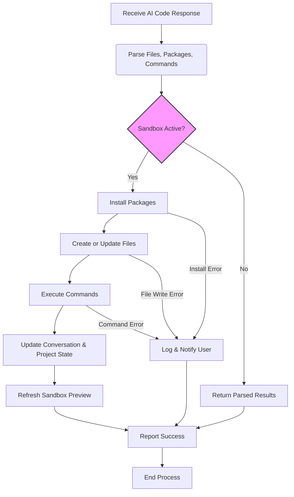

# Applying AI-Suggested Code to Your Sandbox

This page guides you through the process of accepting, reviewing, and applying code suggestions or fixes generated by AI to your active sandbox environment in Open Lovable. It details how streaming feedback works, how packages are installed, commands executed, and your conversation context updated. You'll also learn how errors are handled and strategies to rollback changes if needed.

---

## 1. What This Page Helps You Achieve

When you request AI-generated code changes—whether for creating new components, fixing bugs, or enhancing functionality—this page explains the workflow for seamlessly integrating these AI suggestions into your sandboxed React app environment. You will understand how the application:

- Parses AI responses containing files, package dependencies, and commands.
- Applies those changes incrementally or fully, preserving your existing state.
- Streams real-time progress and feedback as packages install and files update.
- Automatically manages sandbox commands (e.g., starting dev servers).
- Keeps your conversation and project state in sync with applied code.

This workflow enables continuous, interactive development powered by AI, without losing control over your working environment.

---

## 2. Prerequisites

Before applying AI-suggested code, ensure:

- You have an active sandbox environment running a React app created via the Open Lovable sandbox setup.
- Your sandbox connection (`sandboxId`) is established and accessible.
- You have generated AI code or received suggestions from the AI chat.
- Relevant package managers and network access for installing npm dependencies are available.

If you haven't yet created a sandbox, refer to the [Creating and Managing a New AI Sandbox](../getting-started-workflows/initialize-ai-sandbox) guide.

---

## 3. Step-by-Step Instructions

### Step 1: Prepare AI Response for Application

 1. The AI response returned when generating or editing code is parsed for:
    - **Files**: Full source files with paths and complete content.
    - **Packages**: npm packages required, extracted both from explicit XML tags and import statements.
    - **Commands**: Shell commands (e.g., `npm run dev`) to execute in the sandbox.
    - **Metadata**: Additional explanations, file structures, or templates.

### Step 2: Initiate the Apply Code Action

- When you decide to apply the code, the frontend sends the full AI response to the `/api/apply-ai-code-stream` endpoint.
- This endpoint connects or reconnects to your active sandbox.
- A server-sent event (SSE) stream is opened to provide real-time updates.

### Step 3: Install Required Packages

- The system deduplicates package names, ignoring core React packages (`react` and `react-dom`).
- If new packages are required, the sandbox runs `npm install` commands to install them.
- Streaming output provides:
  - NPM install commands initiated.
  - Standard output and error logs.
  - Success or failure statuses.
- The Vite development server is gracefully restarted after package installation to recognize new dependencies.

<Tip>
During package installation, watch for errors in the output stream such as dependency conflicts; these are surfaced gracefully, and the system uses flags like `--legacy-peer-deps` to mitigate common issues.
</Tip>

### Step 4: Create or Update Files

- After package installation completes, the system creates or updates each file in the sandbox as provided by AI.
- Configuration files like `package.json`, `tailwind.config.js`, and others are preserved and skipped to prevent overwriting.
- For JavaScript/JSX/TSX files, CSS imports are removed because Tailwind CSS is managed separately.
- Each file write operation reports progress and completion.
- Existing files are updated, and new files are added to your sandbox's state tracking.

<Tip>
The system normalizes file paths, ensuring component files reside under `src/` or `public/` folders for consistency.
</Tip>

### Step 5: Auto-generate Helper Files (Optional)

- If this is not an edit but rather a fresh generation, and an `App.jsx` file is missing, the system auto-generates a basic `App.jsx` file that imports the main components and provides a styled container.
- Similarly, a default `index.css` with Tailwind directives is generated if missing.

### Step 6: Execute Shell Commands

- AI-provided commands within `<command>` tags are executed sequentially in the sandbox environment.
- The system streams stdout and stderr output in real-time.
- Each command’s success or failure is logged.

<Tip>
Use commands to build, start, or test your app after files are applied.
</Tip>

### Step 7: Handle Missing Imports and Auto-complete

- The system inspects `App.jsx` or equivalent for missing imports.
- If missing components are detected, an automatic request generates those components.
- The system updates the response and provides feedback with warnings or auto-completion statuses.

### Step 8: Update Conversation and Project Context

- After files are applied, the conversation state is updated with metadata about which files were changed.
- Project evolution logs record major changes and timestamps.
- This integration ensures the AI assistant is aware of current codebase state in future prompts.

### Step 9: Refresh Preview and Sandbox

- Upon successful code application, the sandbox iframe is refreshed:
  - Attempts direct navigation with a cache-busting timestamp.
  - Falls back to iframe recreation if direct reload fails.
- This ensures your live preview accurately reflects the latest changes.

<Tip>
Refreshing includes configurable delays depending on whether new packages were installed, to allow the Vite dev server to restart properly.
</Tip>

---

## 4. Practical Example

Suppose you requested AI to "Add a video gallery component". After AI responds with the files, required packages (e.g., `react-player`), and commands:

1. You trigger applying the generated code.
2. The system installs `react-player`, showing streaming npm install output.
3. Creates or updates files including `VideoGallery.jsx` and updates `App.jsx`.
4. Runs `npm run dev` to restart the development server.
5. Streams command outputs, showing success.
6. Updates your project context and conversation.
7. Refreshes the iframe preview.

You see progress updates inline and feedback messages for each operation.

---

## 5. Common Pitfalls & Troubleshooting

<AccordionGroup title="Common Issues and Solutions">
<Accordion title="Package Installation Fails with Dependency Conflicts">
If you see errors related to peer dependencies or ERESOLVE errors:

- The system uses `--legacy-peer-deps` flag for installs to mitigate.
- Review the error logs in the chat interface.
- Try manually running `npm install` in the sandbox to debug.
- Verify network connectivity for package registries.
</Accordion>

<Accordion title="Files Are Not Updated After Applying Code">
- Confirm that you have an active sandbox.
- Check logs to see if file write commands failed.
- Check for any permission errors or file system issues.
- Ensure that your AI response contains `<file>` elements with full content and closing tags.
- Refresh the sandbox manually if the iframe does not update.
</Accordion>

<Accordion title="Commands Do Not Execute or Fail">
- Ensure the commands are valid for your sandbox environment.
- Streaming output shows stdout and stderr; use these logs to diagnose.
- Some commands may require longer timeouts; adjust configurations if necessary.
- If commands run but app doesn't update, check development server logs.
</Accordion>

<Accordion title="Sandbox Reconnection Fails During Application">
- Occurs if sandbox expired or disconnected.
- UI will surface an error indicating failure to reconnect.
- Create a new sandbox and retry applying code.
</Accordion>
</AccordionGroup>

---

## 6. Best Practices

- Always apply changes incrementally rather than regenerating the entire app unless explicitly requested.
- Confirm package names before applying; avoid unnecessary additions.
- Use the streaming feedback panel to monitor progress and catch errors early.
- Maintain consistent naming and modular component design to simplify AI edits.
- Use the conversation context to inform the AI about recent changes and avoid duplicate files.

---

## 7. Rollback and Recovery Strategies

- The system currently does not provide automatic rollback but tracks applied files and history.
- In case of errors:
  - Review error messages in the chat and logs.
  - Manually revert files or sandbox to previous state if needed.
  - Reapply a known good code generation from previous conversation context.
- For partial failures, inspect which steps succeeded and adjust accordingly.

---

## 8. Related Documentation

- [Creating and Managing a New AI Sandbox](../getting-started-workflows/initialize-ai-sandbox)
- [Generating React App Code with AI](../getting-started-workflows/ai-code-generation)
- [Automated Package Detection and Installation](../advanced-usage-integration/package-management-automation)
- [Dealing with Errors and Leveraging Live Feedback](../best-practices-troubleshooting/handling-errors-feedback)

---

## Appendix: Example XML Tags in AI Responses

```xml
<explanation>
Adding a new video gallery component with required packages and commands.
</explanation>

<packages>
react-player
</packages>

<file path="src/components/VideoGallery.jsx">
import React from 'react';
import ReactPlayer from 'react-player';

function VideoGallery() {
  return (
    <div className="grid grid-cols-3 gap-4">
      <ReactPlayer url="https://youtu.be/dQw4w9WgXcQ" controls />
      <!-- more videos -->
    </div>
  );
}

export default VideoGallery;
</file>

<command>npm run dev</command>
```

---

This concludes the guide for applying AI-suggested code seamlessly into your sandbox environment with live feedback, package and command management, and conversation state synchronization.

---

# Visual Workflow Diagram



---

# Quick Tips

- Use the built-in streaming feedback to catch issues early.
- Avoid modifying configuration files unless instructed.
- Always verify package installation completion before writing files.
- Keep conversation context updated for better AI suggestions.
- Restart the sandbox or create a new sandbox if problems persist.

---

For any further assistance or to report issues, reach out via the support channels or refer to the community forums.


---