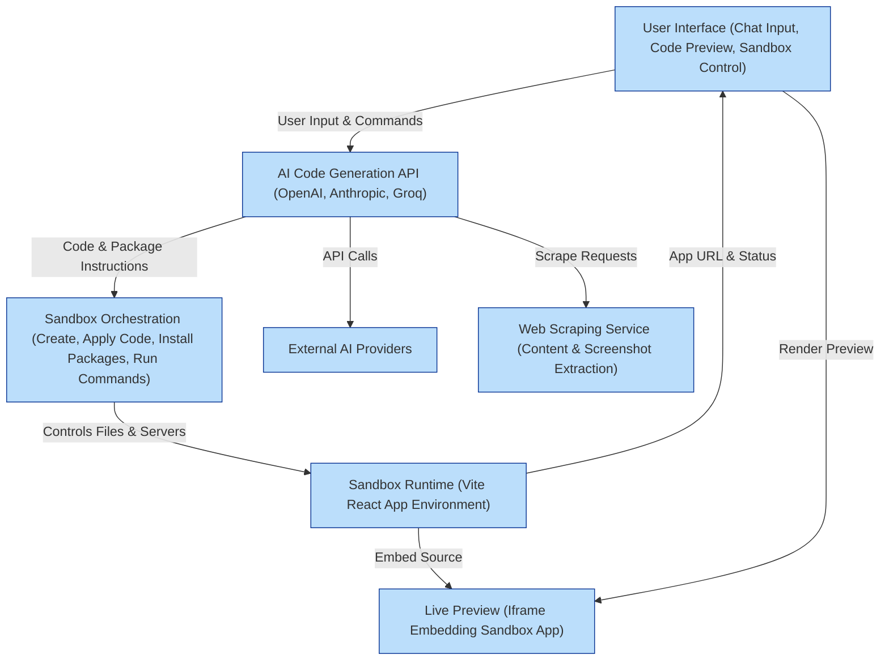

# High-Level Architecture

## Overview

This page presents a clear visualization and explanation of the core architecture behind Open Lovable. The system integrates user interactions, AI code generation, sandbox orchestration, live preview capabilities, and external service integrations to deliver an end-to-end experience that transforms ideas into running React applications instantly.

---

## System Components and Workflow

Open Lovable’s architecture brings together multiple interconnected components, each playing a key role in enabling seamless conversation-driven React app creation and editing:

### 1. User Interface (UI)
- The intuitive frontend where users interact via chat-like messaging.
- Enables entering prompts, viewing AI responses, managing sandboxes, and previewing live app outputs.
- Supports real-time streaming display of generated code and sandbox status.

### 2. AI-Powered Code Generation APIs
- Specialized AI services that receive user prompts plus contextual inputs (such as sandbox files and scraped content).
- Generate React application code, perform surgical edits, and respond incrementally via streamed server-sent events (SSE).
- Integrate with multiple AI models/providers including OpenAI, Anthropic, and Groq, abstracted behind a unified API.

### 3. Sandbox Orchestration
- Manages the lifecycle of isolated development environments (“sandboxes”) that run Vite-based React applications.
- Supports operations such as sandbox creation, code application, package installation, and server restarts.
- Executes file writes and command runs inside sandboxes, ensuring real-time feedback to the UI.
- Tracks sandbox state globally to coordinate with AI and frontend layers.

### 4. Live Preview
- Provides an embedded iframe preview of the running sandbox application in the UI.
- Supports manual refresh, automatic iframe reload on code application, and error states.
- Enables users to see immediate visual results of code generated or edited by AI.

### 5. External Service Integration
- Connects to AI providers (OpenAI, Anthropic, Groq) for code generation and edit intent analysis.
- Utilizes web scraping services to extract content and screenshots from target URLs to provide rich context.
- Handles npm package installation by analyzing AI-suggested dependencies and running package managers inside sandboxes.

---

## End-to-End Workflow

### Step 1: User Initiation
- User enters a prompt, URL for cloning, or specific edit request via the UI chat.
- The UI manages sandbox connection and decides if a new sandbox must be created.

### Step 2: Context Preparation
- The system fetches the current sandbox file structure and content.
- Scraped website content or user-provided context is included if applicable.
- Conversation history and prior generated components are factored into context.

### Step 3: AI Code Generation
- The prompt plus context is sent to the selected AI model via the code generation API.
- Streaming responses provide incremental file content, package suggestions, commands, and explanations.
- Edit intents trigger targeted file search and precise code modification workflows.

### Step 4: Code Application and Package Installation
- The backend orchestrates applying generated code files inside the sandbox.
- Packages declared in AI responses are automatically installed.
- Commands such as dev server start scripts are executed.
- Real-time feedback about progress and errors streams back to the UI.

### Step 5: Live Preview and Interaction
- The UI iframe refreshes or reloads to reflect the latest sandbox state.
- Users can interact with the live app, continue modifying via chat, or download the full project.

### Step 6: Conversation State Maintenance
- The system tracks applied code, generated components, and user preferences throughout the session.
- Ensures continuity across multiple prompts or edits with context-aware AI engagement.

---

## Mermaid Diagram of High-Level Components and Flow

---

## Component Roles Explained

| Component           | Role & Responsibilities                                                         |
|---------------------|---------------------------------------------------------------------------------|
| **User Interface**  | 
- Facilitates rich chat interaction including code generation prompts.
- Displays real-time streaming AI responses and terminal-style feedback.
- Manages sandbox lifecycle commands and preview toggling.
| 
| **AI Code Generation APIs** | 
- Generate and edit React application code based on user input and context.
- Support conversational state awareness and incremental streaming.
- Analyze user intent for precise surgical edits.
|
| **Sandbox Orchestration** | 
- Creates isolated, containerized dev environments.
- Applies generated files, manages package dependencies and runs commands.
- Maintains sandbox state for live preview and incremental updates.
|
| **Sandbox Runtime** | 
- Hosts the running Vite React app.
- Serves the live preview iframe.
|
| **Live Preview**    | 
- Embeds running app in the UI for immediate visual feedback.
- Supports user-driven reload and automatic refresh on code changes.
|
| **External Services** | 
- Provides AI model APIs for code and intent generation.
- Web scrapers pull site content and screenshots for contextual AI generation.
|

---

## Summary

Open Lovable’s architecture is optimized for rapid React application creation and incremental editing through AI conversational workflows combined with sandboxed live development environments. It delivers transparency with real-time streaming feedback, automated package management, and code application, culminating in immediate visual preview and interaction.

---

## Next Steps

- Explore the [Feature Overview](/overview/product-introduction-and-value/feature-at-a-glance) for detailed capabilities
- Learn to [Create and Manage AI Sandboxes](/guides/getting-started-workflows/initialize-ai-sandbox)
- Dive into [Automated Package Detection and Installation](/guides/advanced-usage-integration/package-management-automation) for dependency handling
- Review [Cloning Websites and Importing External Code](/guides/advanced-usage-integration/scrape-clone-websites) to leverage scraping capabilities

---

## Tips

- Understanding this architecture helps troubleshoot code generation delays and sandbox refreshes.
- Familiarize yourself with the sandbox lifecycle to optimize your development cycles.
- Leverage the streaming AI feedback to monitor generation phases and package installations.

---

For a practical view of this architecture, see the components and APIs exposed in the source code and accompanying diagrams on this page.

---