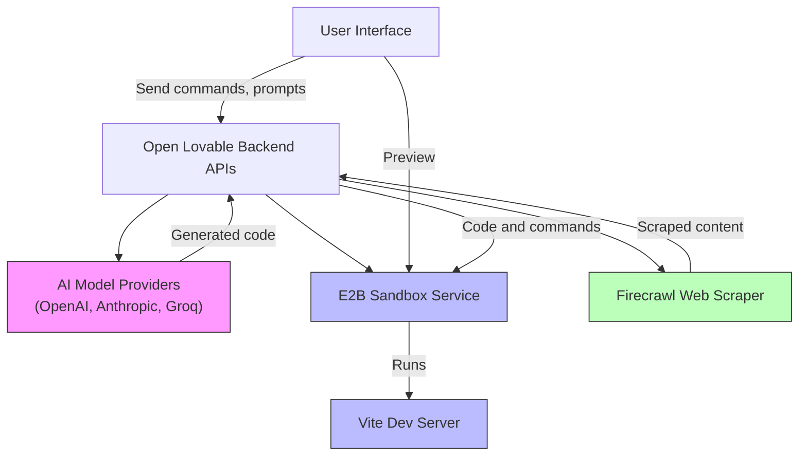

# Integration & External Services

Open Lovable seamlessly connects to a variety of external systems and AI model providers to empower your rapid React app development. This page details how Open Lovable integrates with AI providers such as OpenAI, Anthropic, and Groq, manages sandbox environments through the E2B service, and uses Firecrawl for efficient website scraping.

Understanding these integrations helps you configure your environment correctly, use the right AI models for your needs, and harness external services effectively for workflows like website cloning, code generation, and sandbox orchestration.

---

## Why This Matters to You

Imagine rapidly recreating a website or enhancing your React app with little setup friction. Open Lovable connects to powerful AI providers to generate and edit code, leverages the E2B sandbox for isolated project environments, and scrapes web content using Firecrawl, all orchestrated transparently through API keys and environment configuration. Knowing how these pieces fit allows you to customize workflows, avoid common pitfalls, and optimize your development flow.

---

## Key Integration Components

### AI Model Providers

Open Lovable supports multiple AI providers, enabling you to choose the provider best suited for your AI-driven React app workflows:

- **OpenAI:** Utilizes models such as `openai/gpt-oss-20b` and the GPT-5 series. Ideal for complex generation with advanced reasoning. Requires `OPENAI_API_KEY`.
- **Anthropic:** Supports Claude-based models like `claude-sonnet-4-20250514`. Offers conversational AI tailored for code generation and editing. Requires `ANTHROPIC_API_KEY`.
- **Groq:** Integrates with Groq's AI API as a specialized option. Requires `GROQ_API_KEY`.

#### How to Configure

Configure API keys within your `.env` file, assigning keys for the AI providers you intend to use:

```bash
OPENAI_API_KEY=your_openai_key_here
ANTHROPIC_API_KEY=your_anthropic_key_here
GROQ_API_KEY=your_groq_key_here
```

The system automatically selects the appropriate provider based on the model name you choose during code generation or editing commands.

---

### E2B Sandbox Service

The E2B sandbox is the core environment where generated React code is built and previewed in real time. It organizes your project files, runs the Vite development server, and isolates your workspace for safe, performant iteration.

- The sandbox handles project setup by configuring a Vite React app with Tailwind CSS.
- It installs npm dependencies and restarts the Vite server as needed.
- Files are created or updated based on AI-generated code streams.
- Commands such as npm installations or build steps are executed inside the sandbox.

#### Environment Setup

Supply your E2B API key in the `.env` file:

```bash
E2B_API_KEY=your_e2b_api_key_here
```

#### Common Operations

- **Sandbox Creation:** Use the `create-ai-sandbox` API to provision a new environment.
- **Sandbox File Management:** Files can be read, written, and updated transparently.
- **Vite Dev Server:** Monitored and restarted if errors or package changes are detected.

#### Best Practices

- Ensure your E2B API key is current.
- When applying new code with package dependencies, trust the automatic package detection and installation implemented during apply workflow.
- Restart the dev server manually only if the automatic process signals failures.

---

### Firecrawl Web Scraping

Open Lovable integrates with Firecrawl for scraping external websites. This capability allows you to input a target URL and have Open Lovable analyze the page structure and content, enabling AI to regenerate it as a React application.

- Firecrawl extracts HTML, metadata, images, and structured information for deep context.
- Scraped data populates the user’s conversation context for AI-driven regeneration.
- Screenshots of websites can be captured for preview and design reference.

#### How to Use

- Enter a URL via the user interface to initiate scraping.
- The sandbox and AI generation will run in parallel upon scraping completion.
- Use additional context inputs to guide AI in styling and functional requirements.

#### Notes

- URLs should be valid and accessible.
- Screenshots improve user feedback on the scraping process.
- Scraping is mainly aimed at single-page applications or sites that can be meaningfully recreated in React.

---

## Configuring API Keys and Environment

To enable these integrations, Open Lovable requires API keys configured in a `.env` file in your project root. Here’s a typical snippet:

```ini
E2B_API_KEY=your_e2b_key
OPENAI_API_KEY=your_openai_key
ANTHROPIC_API_KEY=your_anthropic_key
GROQ_API_KEY=your_groq_key
NEXT_PUBLIC_APP_URL=https://yourhost.example
```

- `NEXT_PUBLIC_APP_URL` helps the backend route calls correctly.
- Leaving any key blank disables that provider.

Make sure to keep your keys secure and never commit them into public repositories.

---

## When To Use Each Provider

| Provider | Best Use Case                        | Notes                                 |
| -------- | ---------------------------------- | -------------------------------------|
| OpenAI   | General-purpose React code tasks, complex logic, GPT-5 models | Best for advanced reasoning demands    |
| Anthropic| Conversational edits, rewrite tasks, Claude models             | Strong for surgical code modifications |
| Groq     | Alternative AI for prompt flexibility                           | Limited availability                   |

The choice usually depends on your API access, performance needs, and cost considerations.

---

## Troubleshooting Common Issues

### Missing Packages or Vite Errors

- Open Lovable detects missing npm packages during code application.
- It installs dependencies automatically.
- Restarting the Vite dev server is handled internally but can be forced via the `/api/restart-vite` endpoint if problems persist.

### Sandbox Connectivity

- Ensure the sandbox is active and healthy through status checks.
- If no active sandbox exists, create a new one via the UI or API.

### Web Scraping Failures

- Verify that the URL is correct and publicly accessible.
- Network issues may cause scraping or screenshot capture failures.
- Retry with the correct URL format (including protocol).

---

## Practical Workflow Example: Cloning a Website

1. Enter the target website URL in the UI.
2. Firecrawl scrapes the website and captures a screenshot.
3. Open Lovable creates or restores an E2B sandbox for code generation.
4. AI generates React components based on the scraped content using the selected AI model.
5. The generated code is automatically applied to the sandbox, npm packages installed, and the Vite server restarted.
6. The sandbox iframe previews the live React app recreation.
7. You can iteratively refine your app via chat commands, which edit code surgically using targeted AI editing modes.

---

## Summary of External Services Interaction



---

## Next Steps

- **Set Your API Keys:** Ensure your `.env` file includes valid keys for your required AI providers and E2B sandbox.
- **Create a Sandbox:** Use the UI or `/api/create-ai-sandbox` to prepare your environment.
- **Select AI Model:** Choose from OpenAI, Anthropic, or Groq per your needs.
- **Try Website Cloning:** Enter URLs to test the scraping and generation features.
- **Explore Advanced Integration:** See the [Advanced Usage & Integration](../../guides/advanced-usage-integration/package-management-automation) section to customize package management and external code imports.

---

## Related Documentation

- [Product Value Proposition](/overview/product-introduction-and-value/product-value-proposition) – Understand the core capabilities.
- [High-Level Architecture](/overview/architecture-and-core-concepts/high-level-architecture) – See how these services interconnect.
- [Environment Configuration](/getting-started/setup-installation/environment-configuration) – Learn to setup your `.env` file.
- [Creating and Managing a New AI Sandbox](/guides/getting-started-workflows/initialize-ai-sandbox) – Step-by-step sandbox creation.
- [Cloning Websites and Importing External Code](/guides/advanced-usage-integration/scrape-clone-websites) – Detailed guide on web scraping and cloning.

---

Open Lovable's integration and external services page equips you to harness its flexible AI backends, sandbox environment, and web scraping capabilities efficiently — the foundation for swift, scalable React app development.