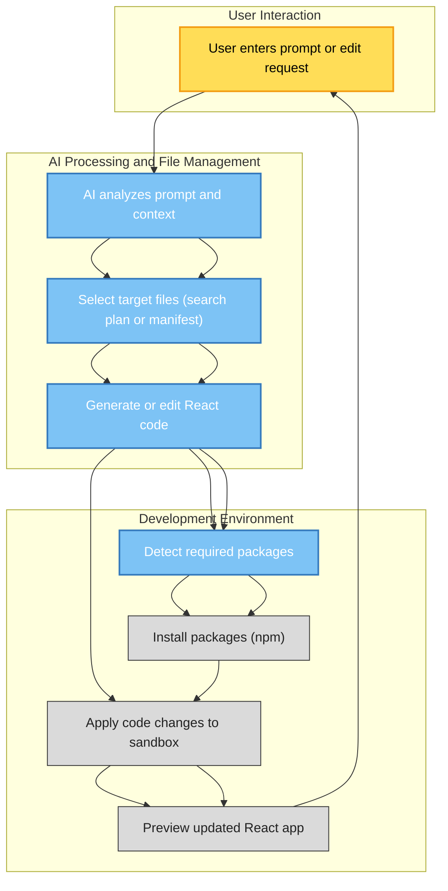

# Feature Overview

Discover the powerful capabilities that make Open Lovable an indispensable tool for modern developers, designers, and teams looking to rapidly create, modify, and preview React applications through AI-powered workflows.

---

## AI-Powered Code Generation and Editing

Open Lovable leverages state-of-the-art AI models to turn your conversational prompts into fully functional React code. Whether you're building a new app or incrementally updating an existing one, the AI understands your intent and works with surgical precision.

- **Context Awareness:** The AI maintains awareness of your entire sandbox environment, including file structure and recent conversation history, ensuring edits are relevant and precise.
- **Incremental Edits:** Request targeted changes like "update the header color" or "fix button spacing," and Open Lovable modifies only the necessary files without disrupting your codebase.
- **Comprehensive Generation:** For initial app creations or large feature additions, the AI generates complete React components with proper structure, styling, and imports.

*Example:* Simply ask to "add a submit button to the Hero section," and the system updates the exact file with minimal and precise changes.

---

## Sandboxed Environments and File Management

Open Lovable creates isolated sandboxes that mirror your project structure, allowing secure, independent development and testing.

- **Automatic Sandbox Creation:** Spin up a sandbox with context-aware parsing of your project files and structure.
- **File Explorer Integration:** Browse all files, view their content with syntax highlighting, and track edited files in real-time.
- **Manifest Support:** Utilizes file manifests to guide AI editing workflows, improving accuracy.

*Use Case:* When you want to experiment with changes without affecting your main codebase, sandboxed environments provide a safety net with instant feedback.

---

## Real-Time Code Streaming and Generation Feedback

Experience transparent, live updates as your AI-guided code is generated and applied.

- **Streaming Responses:** View the code being generated live, file-by-file, with up-to-date status messages.
- **Current File Preview:** Monitor ongoing generation for each file, helping you track progress and anticipate results.
- **Dynamic Status Updates:** Receive messages about AI thinking time, component generation steps, and completion notifications.

*Practical Tip:* If you want to see how your requested changes unfold step-by-step, switch to the live code generation tab to watch in action.

---

## Automated Package Detection and Installation

Open Lovable seamlessly manages dependencies derived from your code edits.

- **Automatic Detection:** Packages required by the generated code are detected from import statements and XML tags.
- **Real-Time Installation Feedback:** Monitor installation progress with clear, terminal-style outputs, including success confirmations and any error messages.
- **Command Execution:** The system runs necessary commands like `npm install` or `npm run dev` automatically, streamlining your development flow.

*Common Pitfall to Avoid:* While package installation is automated, ensure your project has a valid package.json and network access to npm.

---

## Instant Preview and Live Application Updates

Get immediate visual feedback on your project as AI-generated code is applied.

- **Iframe Sandbox Preview:** Render your React app inside a secured iframe to test UI and interactions instantly.
- **Manual and Automatic Refresh:** Refresh the sandbox preview with a click or let the system auto-refresh when new code is applied.
- **Screenshot and Design Capture:** For website cloning workflows, preview the target site snapshot alongside your generated app for comparison.

*Scenario:* After applying fixes or new features, instantly view them in context without leaving the Open Lovable interface.

---

## Workflow Support and User Experience Enhancements

Open Lovable's feature set is designed around your user journey from concept to live application:

- **Conversational AI Chat:** Interact using natural language, guiding AI to generate or edit code effectively.
- **Detailed Status and Error Handling:** Clear real-time system messages and advanced troubleshooting help resolve issues quickly.
- **File Explorer with Visual Cues:** Easily distinguish new or edited files, track generation progress, and select files for review.
- **Model Selection:** Choose from available AI models based on your preference or task complexity.

---

## Example User Flow

1. **Start a Sandbox:** Automatically creates with your current project context.
2. **Send a Prompt:** "Add a responsive hero section with a call-to-action button."
3. **Watch AI Generate:** Streaming code updates arrive file-by-file.
4. **Apply Changes:** Automated package installation and build commands run.
5. **Preview Instantly:** See your updated React app live in the sandbox iframe.

---

## Practical Tips for Success

- **Keep Prompts Clear and Specific:** The AI works best when instructions specify the exact change or feature.
- **Use Edit Mode for Small Updates:** To avoid redundant rewriting, enable edit mode that locks edits to relevant files.
- **Monitor Package Installation:** If new imports appear, verify that the corresponding packages install properly.
- **Explore Generated Files:** Use the file explorer and syntax highlighting to review changes.
- **Leverage Conversation History:** Reference earlier messages to build on ongoing development smoothly.

---

## Learn More and Next Steps

To deepen your understanding and make the most of Open Lovable, explore the following guides:

- [Creating and Managing a New AI Sandbox](/guides/getting-started-workflows/initialize-ai-sandbox)
- [Generating React App Code with AI](/guides/getting-started-workflows/ai-code-generation)
- [Applying AI-Suggested Code to Your Sandbox](/guides/getting-started-workflows/apply-ai-changes)
- [Automated Package Detection and Installation](/guides/advanced-usage-integration/package-management-automation)
- [Cloning Websites and Importing External Code](/guides/advanced-usage-integration/scrape-clone-websites)

Explore troubleshooting options in [Dealing with Errors and Leveraging Live Feedback](/guides/best-practices-troubleshooting/handling-errors-feedback).

---

For the full source code and updates, visit the [Open Lovable GitHub repository](https://github.com/mendableai/open-lovable).

---

## Visual Overview Diagram

---

Unlock the full potential of rapid React app development with Open Lovable’s cohesive, intelligent, and streamlined feature set.
