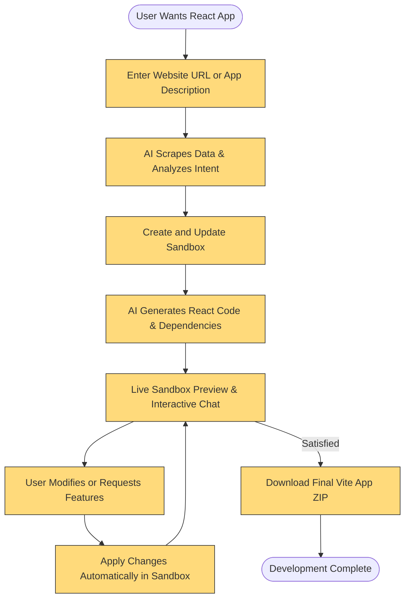

# Target Audience & Use Cases

## Unlock Rapid React Development with Open Lovable

### Who Should Engage with This Page?
This page is designed specifically for developers, product designers, educators, and collaborative teams who need to rapidly prototype, demo, or migrate React applications. Whether you are building an MVP, crafting educational content, or evolving existing codebases with AI assistance, this page offers insights into how Open Lovable accelerates your goals.

---

## Understanding Who Benefits Most from Open Lovable

Open Lovable empowers users across multiple roles, delivering tailored value for each:

- **Developers** looking to fast-track React app creation without manual setup or boilerplate coding
- **Product Designers** who want visual, editable prototypes that can instantly convert design ideas into functional React apps
- **Educators** crafting course materials or tutorials that require live, modifiable React demos
- **Teams** focused on rapid iteration, collaborative reviews, and live demonstrations of front-end ideas

By understanding these core audiences, you gain clarity on when Open Lovable is the right fit for your workflow.

---

## Real-World Use Cases Illustrated

### 1. Minimum Viable Product (MVP) Creation

Imagine a startup team with a bright idea but limited development resources. They want to:

- Quickly spin up a React prototype
- See real-time code changes with AI-powered chat interactions
- Share a live preview with stakeholders instantly

Open Lovable streamlines this:

- AI chat guides you through feature requests
- Dynamic sandbox creation enables immediate code previews
- Automated package management eliminates tedious setup delays

As a result, MVPs get built faster with reduced context switching and fewer integration hurdles.

### 2. Curriculum and Workshop Development

Educators designing React tutorials or workshops often face challenges:

- Keeping examples in sync with real React versions
- Allowing students to experiment on live code

Open Lovable provides an AI-driven sandbox environment where educators can:

- Generate sample React components instantly
- Modify app logic and styles interactively
- Allow students to explore generated code with live previews

This fosters deeper learning by bridging theory and practice seamlessly.

### 3. AI-assisted Code Migration and Refactoring

Large apps require complex refactoring or migration to new frameworks or styles. Teams tasked with this can leverage Open Lovable to:

- Analyze existing app structure through sandbox history and conversation contexts
- Request precise edits via AI conversational prompts
- Automatically detect needed dependencies and install packages
- Apply changes surgically without rewriting entire codebases

This selective, context-aware approach minimizes risk and accelerates modernization efforts.

---

## Why You Should Care: Transforming Development Workflows

### Outcomes You Can Expect

- **Time Savings**: Eliminate hours of manual coding and environment setup through AI-powered generation and instant sandboxing
- **Interactive Prototyping**: Iterate on design and functionality live, reducing friction between ideation and execution
- **Reduced Cognitive Load**: Let AI handle code patterns, package detection, and context awareness so you focus on creativity and problem-solving
- **Team Empowerment**: Share and demo React apps live with URLs, fostering transparency and feedback loops

### Before and After Example

| Without Open Lovable | With Open Lovable |
|---------------------|------------------|
| Manual coding from scratch with uncertain package dependencies | AI generates complete React app structure with automated package installs |
| Static prototypes with no live editing | Real-time sandboxed React app preview, editable via conversational commands |
| Frustrations around environment setup and dependency conflicts | Seamless sandbox creation and environment management handled invisibly |

---

## Summary

Open Lovable's Target Audience & Use Cases page guides you to understand precisely who gains from its capabilities and how real-world scenarios are transformed by AI-driven React app generation and sandboxing.

Whether you are launching an MVP, educating others, or modernizing legacy apps, Open Lovable offers optimized workflows and enormous time savings.

---

## Getting Started Preview

Ready to experience these benefits firsthand? Here's a glance at your first few steps:

1. **Input a Website or App Idea** – Start by entering a URL or describing your desired React app in the chat interface.
2. **Watch AI Analyze & Generate** – Open Lovable scrapes, analyzes, and produces your React app live.
3. **Interact with Live Preview & Code** – View running React sandboxes and customize the code on-the-fly through AI dialogue.

To dive deeper, visit the [Getting Started Guide](/guides/getting-started-workflows/initialize-ai-sandbox) for sandbox setup or the [Feature Overview](/overview/product-introduction-and-value/feature-at-a-glance).

---

## Practical Tips and Best Practices

- Use clear, incremental commands when requesting AI edits to keep control over generated code
- Take advantage of live previews to verify functionality before downloading or sharing
- Incorporate thematic styles through the style selector for consistent UI prototypes
- Always review applied code in the sandbox to ensure business logic aligns with your goals

---

## Related Documentation

- [Product Value Proposition](/overview/product-introduction-and-value/product-value-proposition) – Understand the core benefits and AI integration
- [Package Management Automation](/guides/advanced-usage-integration/package-management-automation) – How automatic package detection works
- [Scraping & Cloning Websites](/guides/advanced-usage-integration/scrape-clone-websites) – Real examples of live React site recreations

---

# Visual Flow: Typical User Journey

---

Your next step is to explore the [Getting Started Guide](/guides/getting-started-workflows/initialize-ai-sandbox) to create your first AI sandbox and see Open Lovable in action.

---

# Troubleshooting and Common Pitfalls

- Make sure your input URL is valid and publicly accessible to ensure accurate scraping
- Be aware that extremely large or complex sites may produce slower generation times
- When requesting edits, be as specific as possible (e.g., "change the hero background to blue") to avoid unexpected results
- If you encounter package errors, use chat commands like "npm install" or "check packages" to trigger automatic installations

---

By focusing on your goals—rapid prototyping, easy editing, and live previews—Open Lovable puts powerful React app creation directly in your hands.

Explore this page as your map to understanding exactly how this tool fits your unique needs.